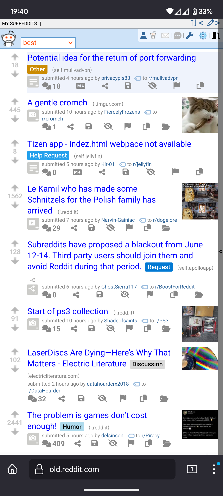
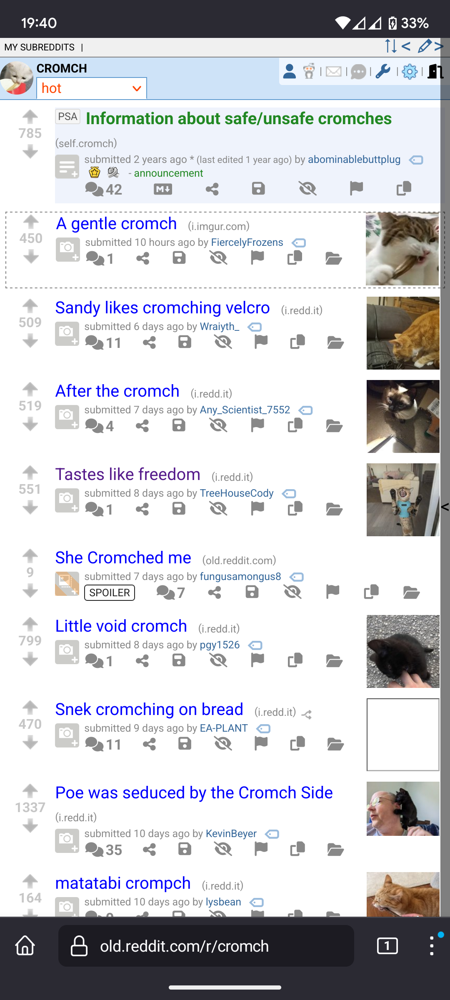
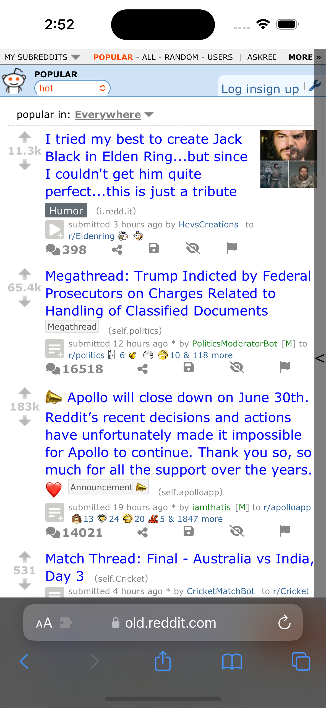
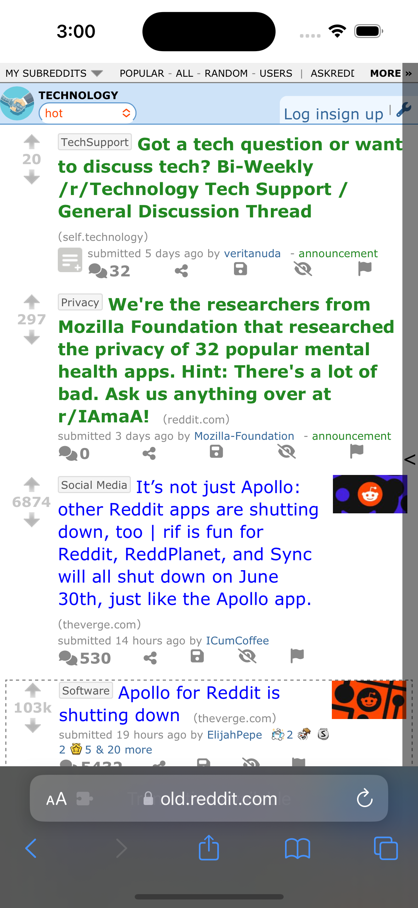
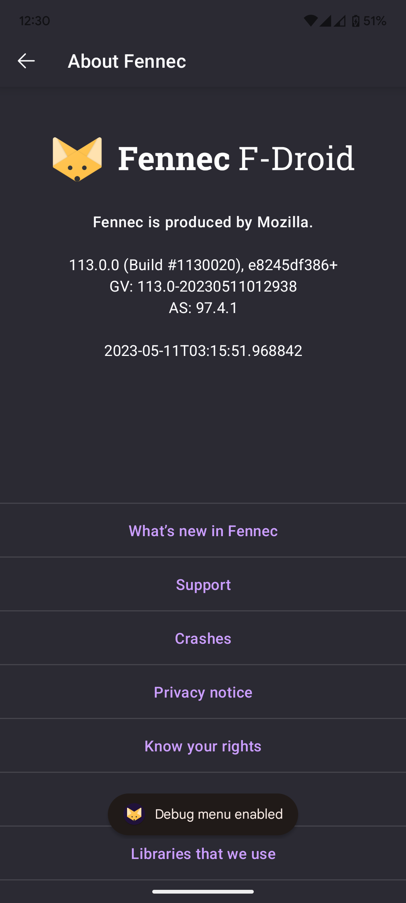
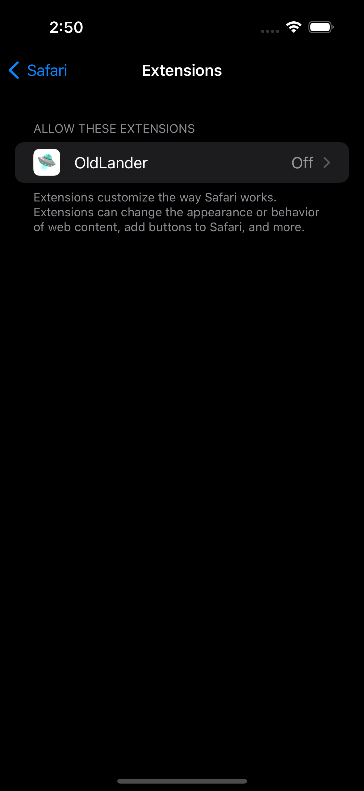
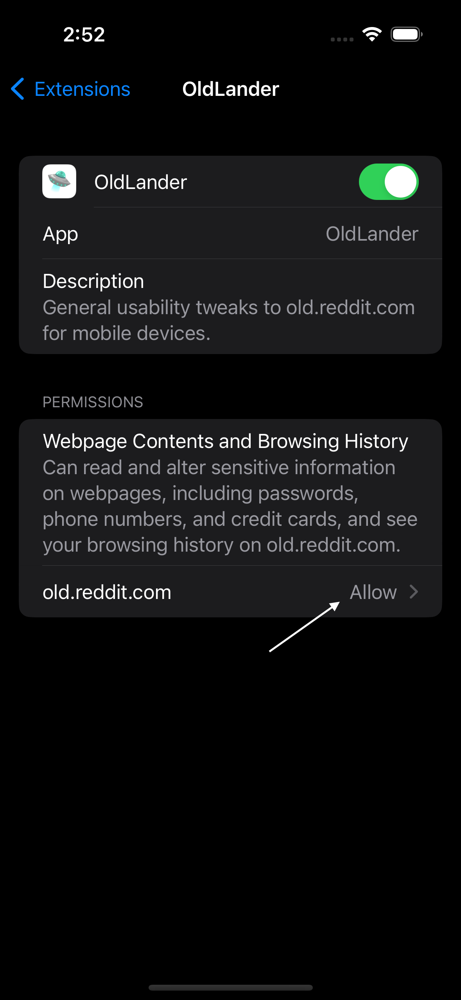

# OldLander

## WARNING WARNING WARNING ADDON IS NOT AVAILABLE ON CHROME WEB STORE - ANYTHING YOU SEE THERE UNDER THAT NAME IS FAKE

## Screenshots

# Android

# iOS

## Installation

### Firefox

Sadly, official stable Firefox does not support custom addons, or setting custom addon collection. However, you have whole three choices as an alternative for normal Firefox!

You can install one of the following instead of normal Firefox:

-   [Firefox Beta](https://play.google.com/store/apps/details?id=org.mozilla.firefox_beta&hl=en&gl=US)
-   [Firefox Nightly](https://play.google.com/store/apps/details?id=org.mozilla.fenix&hl=en&gl=US)
-   [Fennec (Available only on F-Droid)](https://f-droid.org/en/packages/org.mozilla.fennec_fdroid/)

Or you can use [Tampermonkey](https://github.com/OctoNezd/oldlander#tampermonkey) instead.

After installing one of these browsers, follow these instructions:

1. Go to browser settings - go to `About Firefox` (or `About Fennec`, if you installed Fennec).
2. Tap on Firefox or Fennec logo till you see `Debug menu enabled` toast.
   
3. Return back to settings, tap on `Custom Addon Collection`. Enter the following settings:

| Collection Owner (User ID) | `12492822`                       |
| -------------------------- | -------------------------------- |
| Collection name            | `Octo-s-Mobile-FF-Extension-Lis` |

4. Go to Addons, install OldLander
5. (optional) Install RES for infinite scrolling, night mode and other features.
6. (optional) Insta Old Reddit Redirect to block new version.

If you already have a custom addon collection, add [the OldLander addon](https://addons.mozilla.org/en-US/firefox/addon/oldlander/) to it and install.

### Kiwi

Note: this is kinda unsupported, I don't use Chromium browsers.

1. Download addon .crx file from Releases tab.

2. Go to Addons, enable developer mode and click `+(from .zip/.crx/.user.js)`

3. Select downloaded .crx

FYI: Updates should be automatically delivered - pipeline in this repository creates Chrome update list

I cant release it on official store due to the fact I can't pay the registration fee with any of my bank cards.

### iOS

Note: macOS is required for this to work.

Note: before running the following commands, make sure you have Xcode installed.

1. Run `npm run wp-build` to build the extension
2. Open `dist` folder by running `cd dist` in the terminal of your choice
3. Run `xcrun safari-web-extension-converter . --ios-only` to convert the extension to Safari App Extension
4. In the project file, go to `Signing & Capabilities` tab, and select your team. Make sure you've set it up for both targets
5. Select the device you want to run the extension on, and click `Run`
6. After installation go to `Settings -> Safari -> Extensions` and enable OldLander. Make sure `Webpage Contents and Browsing History` is set to "Allow"
   
   

### Tampermonkey

Head to releases, click on latest oldlander.user.js.
